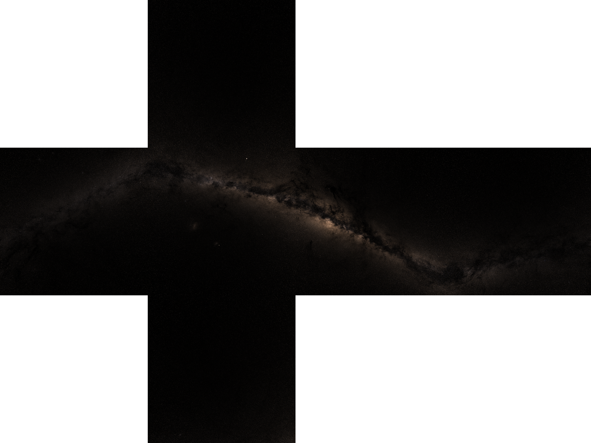

# Skyrender

A simple utility to generate a skybox from star data.

**WARNING: This program downloads 700+ GB of astronomy data the first time it is run.** You probably just want to download one of the pre-generated cubemaps from the releases page.



# Usage

Compile and run with:
```
cargo run --release
```

This will stream about 700 GB Gaia data and save it in condensed form (still ~27 GB) to your local cache directory. If interrupted, it will resume where it left off. Once complete, the program will output `cubemap-1024x1024.png` and `net-1024x1024.png` to the local directory.

Stars brighter than a set magnitude (defaulting to 7.0) are not written to the cubemap. They are instead stored in `bright-stars.bin` so they can be composited on afterwards.

# License

Skyrender is dual licensed under MIT and Apache 2.0 licenses; you may pick either at your option. The cubemaps themselves may be used under [Creative Commons Attribution 4.0 International (CC BY 4.0)](https://creativecommons.org/licenses/by/4.0/).

The star data is sourced from ESA under [this license](https://www.cosmos.esa.int/web/gaia-users/license):

> The Gaia data are open and free to use, provided credit is given to 'ESA/Gaia/DPAC'. In general, access to, and use of, ESA's Gaia Archive (hereafter called 'the website') constitutes acceptance of the following general terms and conditions. Neither ESA nor any other party involved in creating, producing, or delivering the website shall be liable for any direct, incidental, consequential, indirect, or punitive damages arising out of user access to, or use of, the website. The website does not guarantee the accuracy of information provided by external sources and accepts no responsibility or liability for any consequences arising from the use of such data.

# Credits

The Gaia DR3 astronomy data we use requests the following acknowledgement:

> This work has made use of data from the European Space Agency (ESA) mission Gaia (https://www.cosmos.esa.int/gaia), processed by the Gaia Data Processing and Analysis Consortium (DPAC, https://www.cosmos.esa.int/web/gaia/dpac/consortium). Funding for the DPAC has been provided by national institutions, in particular the institutions participating in the Gaia Multilateral Agreement.
